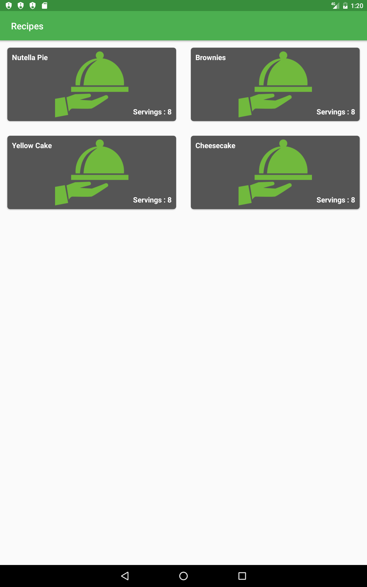
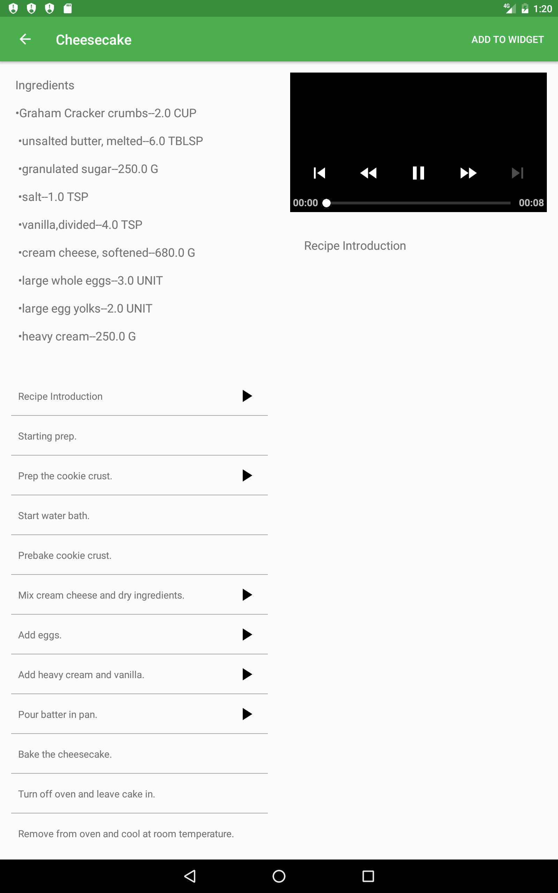
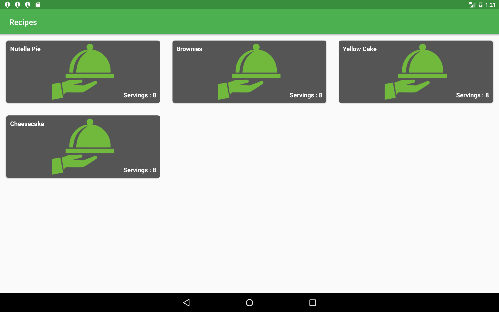
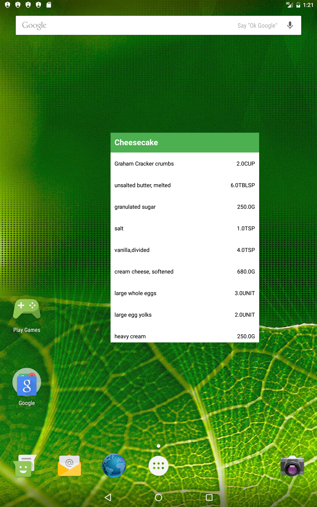
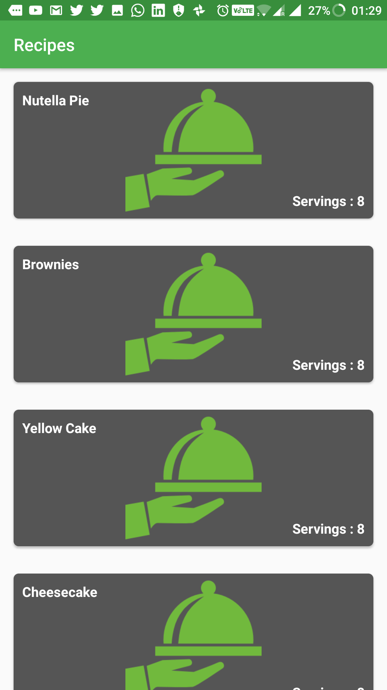
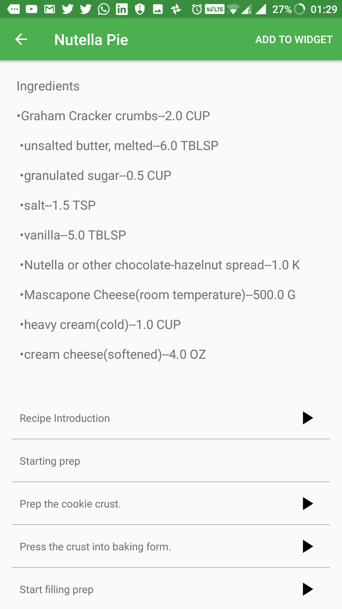
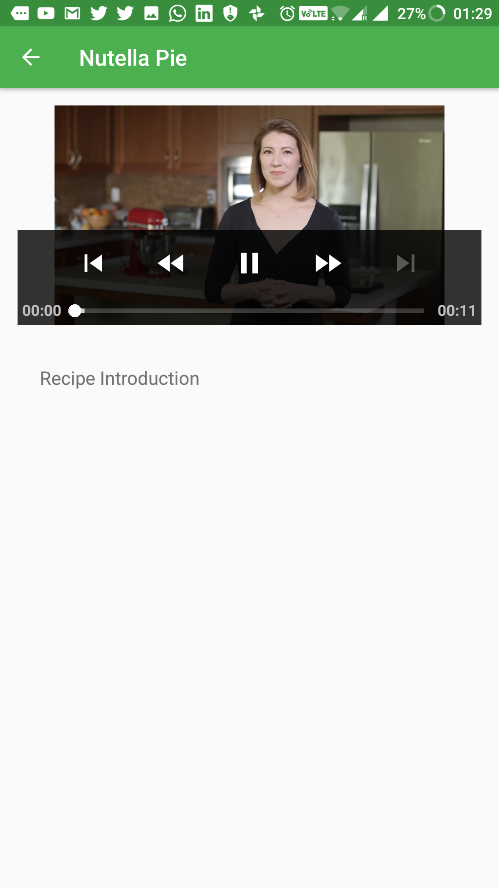

# Baking App Udacity 

 Android App for [Android Developer NanoDegree Program.](https://in.udacity.com/course/android-developer-nanodegree-by-google--nd801/)
 This app allow Udacity’s resident baker-in-chief, Miriam, to share her recipes. App allow user to select recipe and see video steps with text description.
 
## Features
* Use of Exoplayer to display videos
* Add widget to Ingredients of recipe
* Use Fragments to create a responsive design that works on phones and tablets.
* Constraint layout for UI to reduce view hierarchy
* MVP architecture

## Built with
[Butter Knife](http://jakewharton.github.io/butterknife/)
[Retrofit](http://square.github.io/retrofit/)
[LeakCanary](https://github.com/square/leakcanary)

## Architecture

* Provides an example for a basic Model-View-Presenter (MVP) architecture without using any architectural frameworks.

* Act as a reference point for comparing and contrasting with other MVP architectural patterns.

## Screenshots - Tablet

## ScreenShots - Phone

## License

This project is licensed under the Apache License - see the [LICENSE.md](LICENSE.md) file for details
